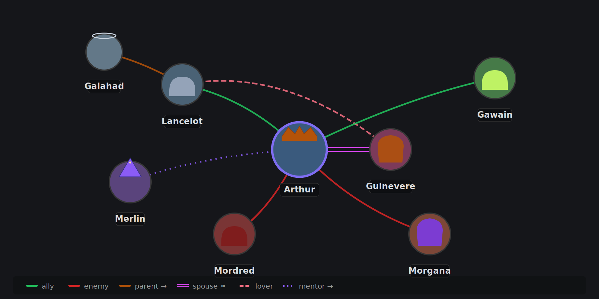
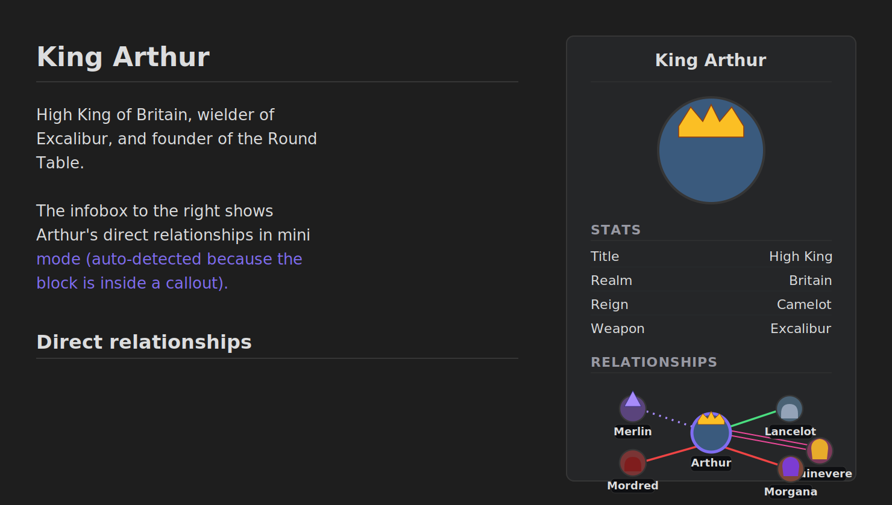

<div align="center">

# Relations

**See how your notes connect.**

Visualise relationships between notes — for **worldbuilding**, **fiction**, **TTRPG campaigns**, **genealogies**, or any project where seeing how things connect matters. Note-driven via frontmatter, with portraits, typed line styles, family-tree layout, and embeddable graphs that work inside callouts and infoboxes.



[Install](#install) · [Quick start](#quick-start) · [Embedding](#embedding-a-graph-in-a-note) · [Family-tree mode](#family-tree-mode) · [Settings](#relationship-types)

</div>

---

## Why

Obsidian's built-in graph shows every link in your vault, all at once, undifferentiated. **Relations** shows just the connections you care about — the ones you've explicitly named — and shows them with meaning: who's allied with whom, who's married, who's a rival, who descended from whom.

Useful for:

- **Worldbuilding** — factions, organisations, cities, gods, dynasties
- **Fiction writing** — story casts, dramatis personae, conflict webs
- **TTRPG campaigns** — NPC networks, allegiances, rivalries, family lines
- **Historical research** — genealogies, political networks, succession charts
- Anything else where you've got a cast of linked notes and want to *see* it

## Install

### Via BRAT (recommended)

[BRAT](https://github.com/TfTHacker/obsidian42-brat) is the standard way to install community plugins that aren't (yet) in Obsidian's official catalogue. It also handles updates automatically.

1. Install the **Obsidian42 - BRAT** plugin from Settings → Community plugins → Browse.
2. Open BRAT's settings and click **Add Beta plugin**.
3. Paste this repository URL: `https://github.com/Obsidian-TTRPG-Community/Relations`
4. Click **Add Plugin**. BRAT downloads it and installs.
5. Settings → Community plugins → enable **Relations**.

BRAT will notify you of updates and apply them when you click through.

### Manual install

1. Download `main.js`, `manifest.json`, and `styles.css` from the latest [release](https://github.com/Obsidian-TTRPG-Community/Relations/releases).
2. Drop them into `<your-vault>/.obsidian/plugins/relations/` (create the folder if it doesn't exist).
3. In Obsidian, Settings → Community plugins → enable **Relations**.

## Quick start

Add a portrait and some relationships to any note's frontmatter:

```yaml
---
npcimage: "[[merlin-portrait.png]]"
ally:
  - "[[Arthur]]"
spouse: "[[Nimue]]"
mentor:
  - "[[Arthur]]"
family:
  - "[[Morgana]]"
---

# Merlin

The court magician of Camelot…
```

Open the graph from the **users** ribbon icon in the left sidebar, or run **Open Relations graph** from the command palette. Click any node to open that note. Right-click for *open in tab* / *open in pane*.

The view has a **Full** / **Active note** toggle:

- **Full** — every connected note in the vault.
- **Active note** — the currently open note plus everyone within N hops (configurable, 1–6).

## Embedding a graph in a note

Use a fenced code block with the `relations` language tag anywhere in a note:

````markdown
```relations
size: small
depth: 1
```
````

> [!TIP]
> Don't want to type the fences? Open the command palette and run **Insert relations code block** to drop a bare block at the cursor, or **Insert relations code block (with all options)** to get every option pre-filled as commented-out lines you can selectively enable.

> [!NOTE]
> ` ```npc-graph ` works too as a legacy alias if you have older notes from before the rename.

### Inside callouts and infoboxes

This is the killer feature for character sheets. Drop a `relations` block inside any callout — `[!info]`, `[!note]`, the popular **ITS Theme** infobox, the **Fancy a Story** fas-infobox, anything — and it auto-renders in compact "mini" mode: smaller portraits, no border, transparent background, tightly packed.



````markdown
> [!infobox|right]
> # Merlin
> ![[merlin.png|cover hsmall]]
> ###### Relationships
> ```relations
> ```
````

The empty block uses sensible defaults — direct neighbours of the host note, mini size, depth 1. You can override with explicit `size: small` or `size: large` if you want the bigger format inside a callout.

### All code-block options

| Option        | Default                | Notes                                                                          |
|---------------|------------------------|--------------------------------------------------------------------------------|
| `size`        | `small`                | `mini` (~160px tall, infobox-friendly), `small` (~320px), `large` (~600px)    |
| `depth`       | size-dependent         | hops from the focus note. `mini` is forced to 1; `small` defaults to 1; `large` defaults to 3 |
| `scope`       | `local`                | `local` (this note + N hops) or `full` (entire vault)                          |
| `tree`        | `false`                | force generic top-down dagre layout                                            |
| `family-tree` | `false`                | proper family-tree layout — see below                                           |
| `zoom`        | `1.0`, `1.4` for mini  | zoom multiplier applied after fit. `1.5` or `"150%"` zooms in 50%             |
| `height`      | size default           | override the embed's height. Accepts `px`, `em`, `rem`, `vh`, `vw`, or `%`     |
| `center`      | host note              | wikilink or path of a different note to focus on, e.g. `"[[King Arthur]]"`     |

## Family-tree mode

A dedicated layout for genealogy-heavy graphs. Bloodline edges build generations, spouses pair side-by-side, and children sit under their parents' midpoint.

Triggered by `family-tree: true` in any code block, or the **Family tree** toggle button in the side-panel toolbar.

```yaml
# Aegon's note
parent:
  - "[[Uther]]"
  - "[[Igraine]]"
spouse:
  - "[[Rhaenys]]"
```

````markdown
```relations
size: large
family-tree: true
```
````

<details>
<summary><b>How the layout actually works</b> (click to expand)</summary>

1. **Bloodline edges build generations.** Any relationship type with **Gen** checked in settings counts as a bloodline. By default only `parent` is gen-flagged. The plugin runs a top-down dagre layout using *only* these edges, so generations stack horizontally.
2. **Spouses pair side-by-side.** Any relationship with **Pair** checked (default: `spouse`) pulls partners onto the same horizontal line.
3. **Children sit under the midpoint** of their parents' positions. Siblings are then spread evenly across the available space.

A few honest limitations:
- **Sibling order isn't deterministic.** Without explicit metadata the layout picks an order that minimises edge crossings, not birth order.
- **Multiple marriages get awkward.** A person with two distinct spouses will have one placed adjacent and the other floating somewhere reachable. Real genealogy tools draw the person twice; we don't.
- **It's a force-directed library doing tree work.** Visually it lands closer to a UML diagram than a sketched parchment chart — structurally correct, aesthetically simpler.

</details>

## Relationship types

Configure types in **Settings → Relations**. Each type has a name (= frontmatter property name), a color, and a set of behaviour flags:

| Flag         | Effect                                                                                                                  |
|--------------|-------------------------------------------------------------------------------------------------------------------------|
| **Sym**      | Symmetric — declaring on either note creates the relationship both ways. Off = one-way (drawn with an arrow).           |
| **Pair**     | Pulls paired nodes very close, with a heavy connector. Use for `spouse`, `partner`, `bonded`.                            |
| **Tree**     | When this type dominates a graph (≥60% of edges), auto-switches to top-down layout.                                       |
| **Gen**      | Genealogy — counts as a bloodline edge in family-tree mode. Typically `parent`.                                          |
| **Line**     | `solid`, `dashed`, `dotted`, or `double`. Useful for marking "secret", "former", "rumored" relationships.               |

Defaults shipped:

| Name    | Sym | Pair | Tree | Gen | Line    |
|---------|:---:|:----:|:----:|:---:|---------|
| ally    | ✓   |      |      |     | solid   |
| enemy   | ✓   |      |      |     | solid   |
| family  | ✓   |      | ✓    |     | solid   |
| friend  | ✓   |      |      |     | solid   |
| rival   | ✓   |      |      |     | dashed  |
| spouse  | ✓   | ✓    |      |     | double  |
| lover   | ✓   |      |      |     | dashed  |
| mentor  |     |      |      |     | dotted  |
| parent  |     |      | ✓    | ✓   | solid   |

Rename, recolour, add, or delete freely — they're just defaults.

## Portraits

The portrait property name is configurable in settings (default: `npcimage`). Accepted forms:

```yaml
npcimage: "[[merlin.png]]"                     # vault wikilink (recommended)
npcimage: "Assets/Portraits/merlin.png"        # vault path
npcimage: "https://example.com/merlin.png"     # external URL
```

The plugin uses Obsidian's resource path resolution, so vault images load even if your vault isn't web-served.

<details>
<summary><b>Frontmatter formats accepted</b> for relationship properties (click to expand)</summary>

```yaml
ally: "[[Bob]]"                     # single
ally: ["[[Bob]]", "[[Alice]]"]      # YAML inline list
ally:                               # YAML block list
  - "[[Bob]]"
  - "[[Alice]]"
ally: "[[Bob]], [[Alice]]"          # comma-separated
```

Aliases (`[[Bob|Bobby]]`) and headings (`[[Bob#background]]`) are normalised to the file link.

</details>

<details>
<summary><b>Including notes in the graph</b> — folder and tag scoping (click to expand)</summary>

By default, any note with at least one configured relationship property qualifies. Notes pointed at by another note's relationship are pulled in too.

For stricter scoping, set **Folder scope** or **Required tags** in settings:
- **Folder scope** — only scan notes under specific folders, e.g. `World/People, World/Factions`.
- **Required tags** — only include notes with one of these tags, e.g. `character, organisation`.

Useful if your vault has lots of incidental wikilinks you don't want polluting the graph.

</details>

## Building from source

```bash
git clone https://github.com/Obsidian-TTRPG-Community/Relations.git
cd Relations
npm install
npm run build
```

Then copy `main.js`, `manifest.json`, and `styles.css` into `<vault>/.obsidian/plugins/relations/` and enable the plugin.

## Roadmap

- Filter chips by relationship type / tag inside the graph
- Edit relationships directly from the graph (right-click → add ally)
- Per-relationship metadata (notes, strength) via richer frontmatter
- Group/cluster by faction tag
- Export graph as PNG/SVG

## Acknowledgements

Built on [Cytoscape.js](https://js.cytoscape.org/) for graph rendering, with [fcose](https://github.com/iVis-at-Bilkent/cytoscape.js-fcose) for force-directed layouts and [dagre](https://github.com/cytoscape/cytoscape.js-dagre) for top-down trees.

## License

[MIT](./LICENSE).
